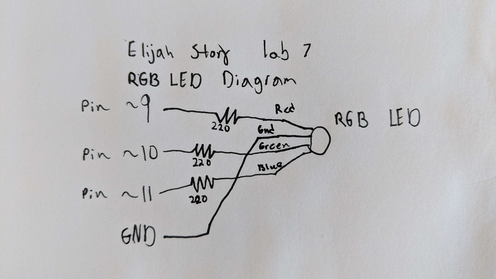
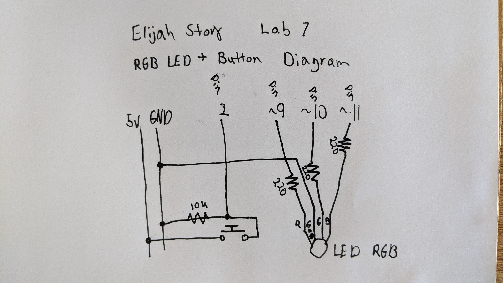

# Lab7-Elijah-Story

## #1
- Here is the link to the video for the faiding LED. [faiding LED](https://photos.app.goo.gl/Cgfohcgcq2TG97TQ7)
- Below is the diagram of the wiring. The wiring is broken in two parts. The first part is the button. The power runs to the button and waits. Once the button is pressed, the power splits and goes to pin 2 and ground. The second part is the LED. The power from pin 9 goes through a 330 resistor then to the positive leg of the LED. The negative leg is connected to ground.

## #2
- Here is the link to the video for the RGB LED. [RGB LED](https://photos.app.goo.gl/Uk6vkaXtYT1z8FRA9)
- Below is the diagram of the wiring. Each leg of the LED goes through a 220 resistor then to its own pin. So the red leg gets power from pin 9, green leg gets power from pin 10, blue leg gets power from pin 11. The ground leg goes straight to ground.

## #3
- Here is the link to the video for the RGB LED with button. [RGB LED-button](https://photos.app.goo.gl/8pnkSjHrcN99i7uE9)
- Below is the diagram of the wiring. This is just a mix of the last two diagrams. The wiring is broken in two parts. The first part is the button. The power runs to the button and waits. Once the button is pressed, the power splits and goes to pin 2 and ground. The second part is the RGB LED. Each leg of the LED goes through a 220 resistor then to its own pin. So the red leg gets power from pin 9, green leg gets power from pin 10, blue leg gets power from pin 11. The ground leg goes straight to ground.

## #4
- My lantern will live inside due to the paper mache. The plan is to have a button turn it on or off then a ultrasonic sensor to make the light change as someone gets closer. I am not sure what it is going to do at the moment, but I am thinking about giving the light a personality. It might get scared as you approach it and dim.
